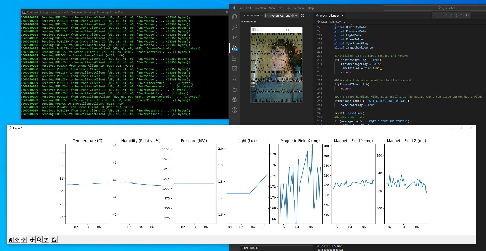
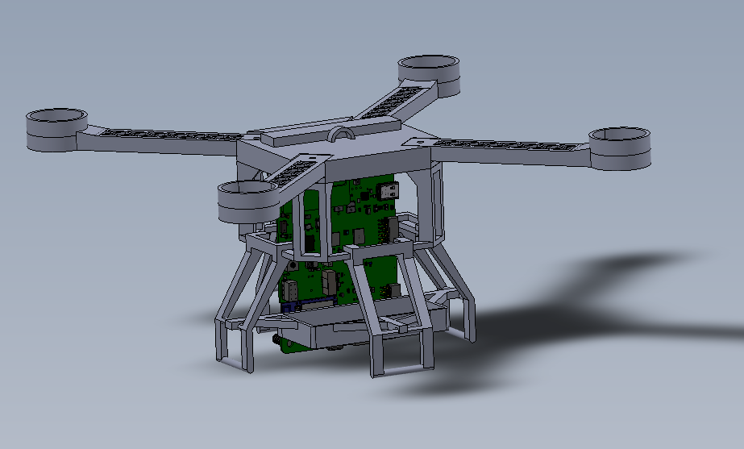
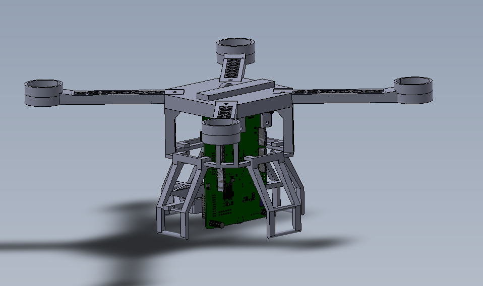
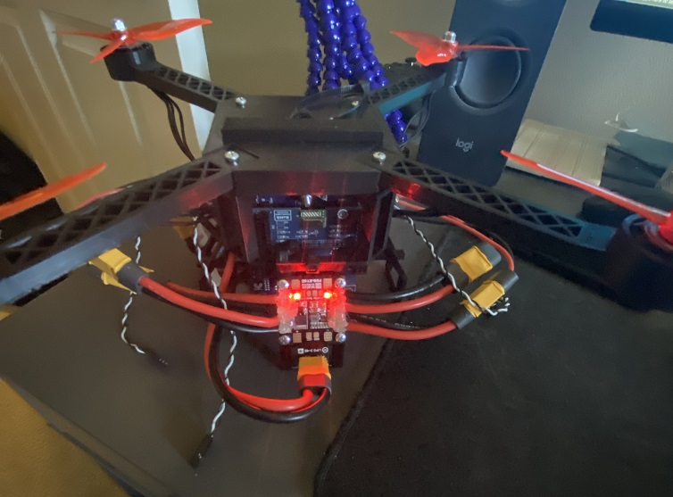

# SurveillanceSystem

This project is a MQTT Based 'surveillance system'. It uses the B-U585I-IOT02A STM32 Discovery board which comes equipped with several sensors and a 30 pin ZIF connector used to interface with a camera (OV5640). The camera is part of a COTs module B-CAMS-OMV, which is also from ST Micro. It comes with an EMW3080B chip programmed using ST's X-WIFI-EMW3080B firmware package. The EMW3080 forms the 802.11 network interface.  

This project is "Part 1" of a larger project I am working on: A Quadcopter/Drone. It establishes most of the infrastructure necessary to write the application code to control a drone (i.e. reading the gyro, accelerometer, pressure sensor, magnetometer, and receive/send data over Wi-Fi). The transmitted data can be viewed using the python script located in the git Repo as seen below.

The most obvious known issue with the project is in the above photo: The horrible camera quality. I am currently investigating the root cause. 

As of now, the program simply reads data from the on-board sensors, sends the data to an MQTT broker hosted on my local desktop over TLS. In order for someone to recreate the project, they will need to generate their own CA file which will be stored both on the MQTT broker, and the microcontroller. The firmware is ThreadX RTOS based, using NetX Duo as the TCP/IP Stack. 

Next steps for the project is to add an extended Kalman filter to measure the board's attitude, and implement PID control for 4 brushless DC motors. 

The above models have already been 3D printed and assembled:

